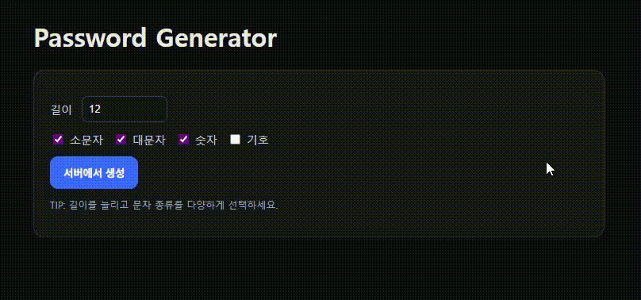
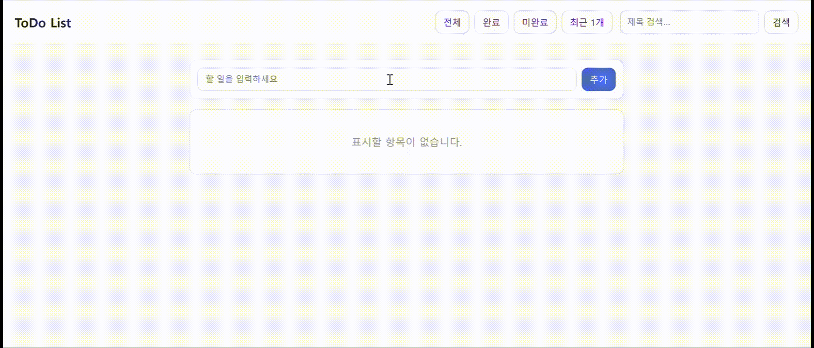
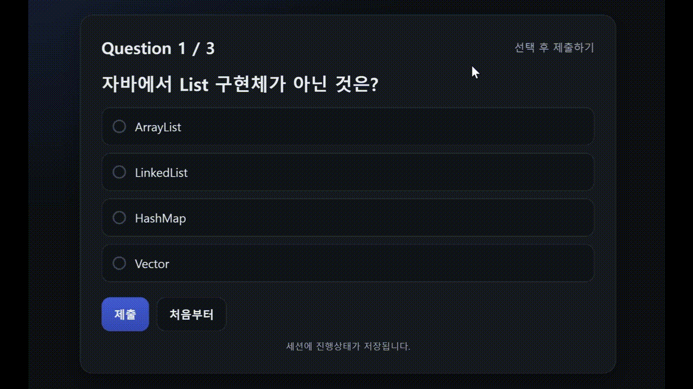
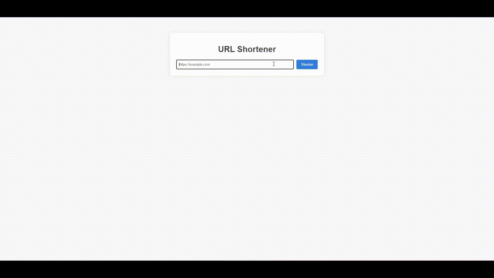
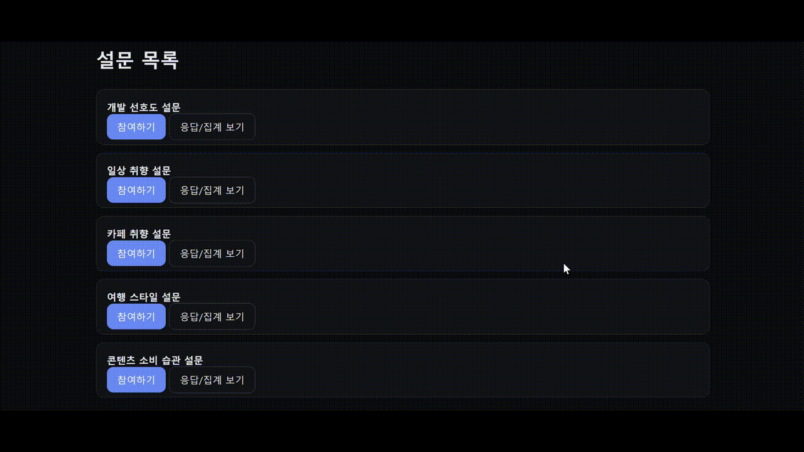

## 1. Password Generator
---

 길이·규칙 선택으로 랜덤 비밀번호를 생성하는 1페이지 앱

**기능**
- 길이 지정(4–64)
- 포함 규칙: 대문자/소문자/숫자/특수문자 체크 → 비밀번호 생성
- 유효성 처리: 규칙 미선택 시 안내, 길이 범위 벗어나면 보정/에러

**Stack**: Spring Boot, Mustache, SecureRandom

**API**
| Method | Path        | Description |
| -----: | ----------- | ----------- |
|    GET | `/password` | 폼 페이지       |
|   POST | `/password` | 결과 화면 렌더링   |

## 2. To-Do List
---

 할 일 목록을 생성, 조회,완료 토글, 삭제(CRUD) 기능 구현

**기능**
- 할 일 추가 / 삭제 / 완료 토글
- 완료 여부 필터링
- 제목 키워드 검색
- 최근 생성 1개 조회

**Stack**: Spring Boot, Mustache, JPA, Lombok, H2 Database

**API**
| Method | Path                 | Description |
| -----: | -------------------- | ----------- |
|    GET | `/todos`             | 메인 목록       |
|    GET | `/todos/done/{done}` | 완료/미완료 필터링  |
|    GET | `/search`            | 제목 키워드 검색   |
|    GET | `/latest`            | 최근 생성 1개    |
|   POST | `/todos`             | 생성          |
|   POST | `/todos/{id}/toggle` | 완료 토글       |
|   POST | `/todos/{id}/delete` | 삭제          |

## 3. Quiz App
---

 3문항 퀴즈를 풀며 세션으로 점수 상태 관리

**기능**
- 현재 문항 렌더링
- 정오답 처리 후 다음 문항 진행
- 최종 점수 페이지
- 다시 하기

**Stack**: Spring Boot, Mustache, Lombok, HttpSession

**API**
| Method | Path           | Description |
| -----: | -------------- | ----------- |
|    GET | `/quiz`        | 현재 문항 렌더    |
|   POST | `/quiz/answer` | 정답 처리 → 다음  |
|    GET | `/quiz/result` | 최종 점수       |
|   POST | `/quiz/reset`  | 다시 하기       |

## 4. URL Shortener
---

 BASE62로 단축 코드를 만들고 리다이렉트 시 조회수를 증가

**기능**
- Base62 인코딩 방식으로 단축 URL 생성
- 원본으로 리다이렉트 시 조회수 증가 및 조회 기능

**Stack**: Spring Boot, Mustache, Lombok, Base62

**API**
| Method | Path                       | Description         |
| -----: | -------------------------- | ------------------- |
|    GET | `/`                        | URL 입력 폼            |
|   POST | `/shorten`                 | 단축 생성               |
|    GET | `/r/{code:[0-9A-Za-z_-]+}` | 원본으로 리다이렉트(+조회수 증가) |
|    GET | `/state/{code}`            | 조회수 조회              |

## 5. Survey App
---

 설문 응답을 저장하고 같은 화면에서 간단 집계를 렌더

**기능**
- 설문 리스트 → 상세 → 응답 제출
- 선택지 빈도 카운트로 간단 집계(동일 페이지 하단 표기)

**Stack**: Spring Boot, Mustache, Lombok, H2 Database

**API**
| Method | Path                      | Description   |
| -----: | ------------------------- | ------------- |
|    GET | `/surveys`                | 설문 리스트        |
|    GET | `/surveys/{id}`           | 설문 상세         |
|   POST | `/surveys/{id}/submit`    | 응답 저장         |
|    GET | `/surveys/{id}/responses` | 응답 목록 + 간단 집계 |
